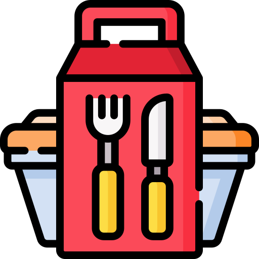
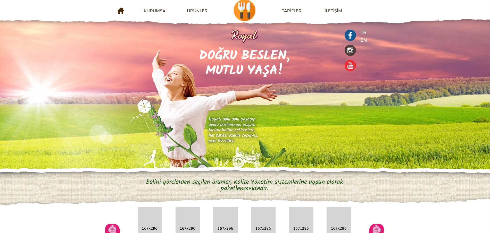
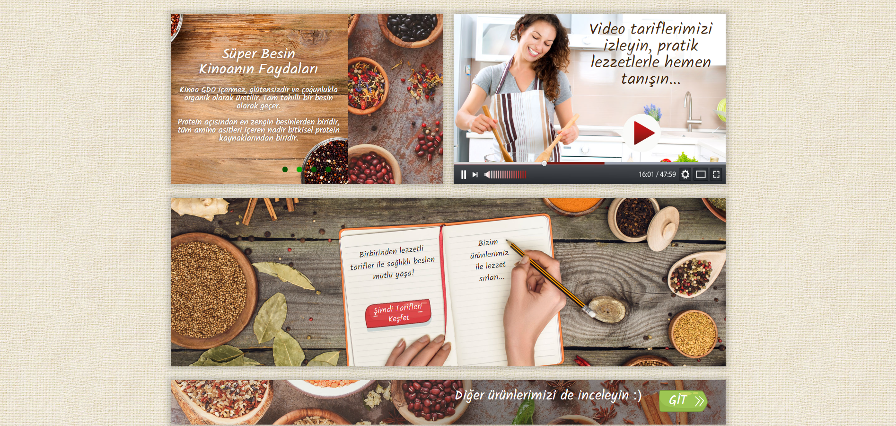
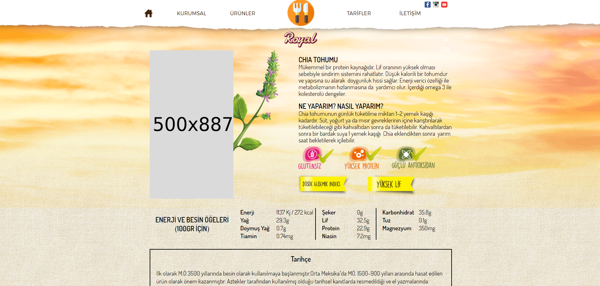
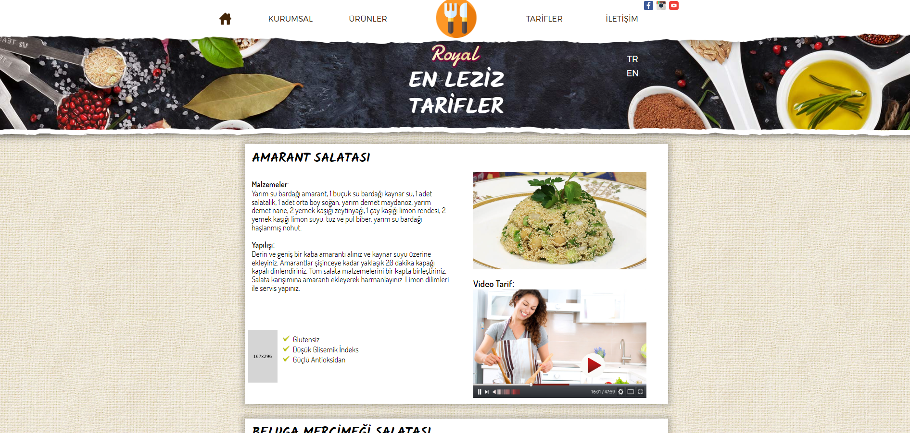
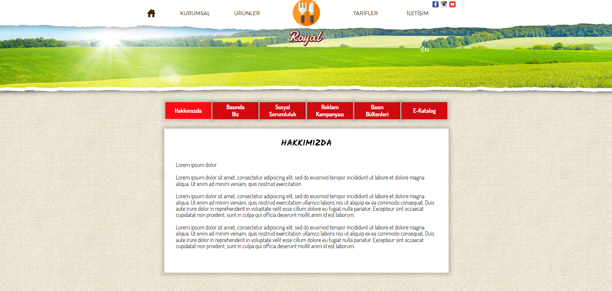

<div align="center">
  
</div>

##  About The Project

This project is a website that introduces various dried food products and provides recipes that can be made with these products. Our website aims to help users learn about the benefits, nutritional values, and uses of dried foods. In addition to offering detailed information on each product, we also share delicious and healthy recipes that can be made with these ingredients.

```html
<!-- HTML Meta Tags -->
<meta charset="UTF-8">
<meta name="viewport" content="width=device-width, initial-scale=1, maximum-scale=1">
<meta name="author" content="Sinan Özçelik">
<meta name="publisher" content="VS 2022">
<!-- Web Site Title -->
<title>Php Food Royal Web Template</title>
<!-- Meta Open Graph -->
<meta property="og:locale" content="en_US" />
<meta property="og:type" content="website" />
<meta property="og:title" content="Homepage" />
<meta property="og:url" content="Php Food Royal Web Template" />
<meta property="og:site_name" content="Php Food Royal Web Template" />
```

##  Features

- [x] Home Slider
- [x] Valid HTML5 and CSS3
- [x] SEO Optimized
- [x] Social Media Icons
- [x] Google Fonts
- [x] Cross Browser Compatible

##  Build With


##  Installation

1. Check the database connection on the Genel.php and PanelGenel files. Customize the database connection path here according to your own computer. By default the database name is fooddb.

   ```php
    $servername = "localhost";
    $username = "root";
    $password = "";
    $dbname = "fooddb";
   ```

2. Import the fooddb.sql file in the root directory into the database via phpmyadmin.
   
3. You can use the information below to enter the admin panel. You can use the /panel address path for the admin panel.
* Username: admin
* Password: admin

## 💻 Project View











##  Contact Information

You can reach out to me using the following contact details:

[](mailto:info@sinanozcelik.com)

[](https://sinanozcelik.com)

I'm always open to development and collaboration. Feel free to reach out to me!